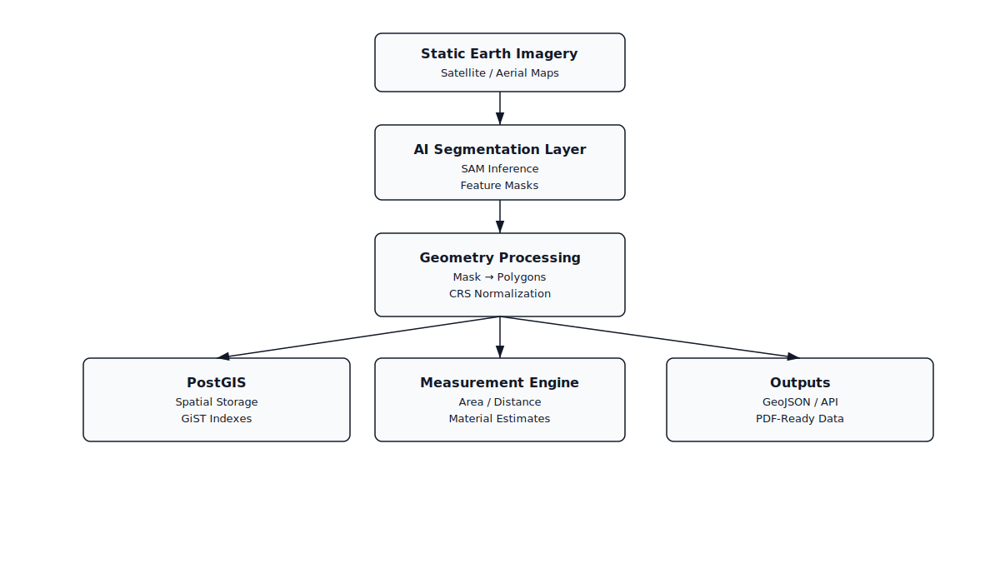

# Geospatial AI Analysis Pipeline

**(SAM + PostGIS + Deterministic Geometry Processing)**

<p align="center">
  
</p>

<p align="center">
  <em>High-level architecture showing AI inference, deterministic geometry processing, and PostGIS-backed measurements.</em>
</p>

---

## Introduction

Hi, I’m Vishnu — thank you for considering my profile.

This repository demonstrates my approach to building a **production-grade Geospatial AI system** for extracting, measuring, and reporting real-world landscape features from static Earth imagery.
The emphasis is on **accuracy, reliability, and long-term maintainability**, not demo-style prototypes.

I enjoy solving complex problems end to end and designing systems that remain stable under real-world data, imperfect AI outputs, and evolving requirements.

---

## Problem Statement

Manual landscape measurement using aerial imagery is slow, inconsistent, and error-prone.
While AI can assist with feature detection, **AI outputs alone are not reliable enough** for measurements that drive cost estimates or client-facing decisions.

This system combines:

* AI for feature detection
* Deterministic geospatial processing for correctness
* Spatial databases for auditability

The result is a pipeline that produces **explainable, reproducible, and defensible measurements**.

---

## High-Level Workflow

1. Static satellite or aerial imagery is ingested
2. AI model segments landscape features
3. Segmentation masks are converted into polygons
4. Geometries are validated and re-projected to a safe CRS
5. Polygons are persisted in PostGIS
6. Deterministic algorithms compute areas and distances
7. Structured outputs are generated for maps and reports

---

## Architecture Overview

### Design Principles

* Separation of concerns (AI ≠ geometry ≠ business logic)
* CRS correctness over convenience
* Deterministic math over AI confidence
* PostGIS as the system of record

### Core Components

#### 1. AI Segmentation Layer

* Uses **Segment Anything Model (SAM)** for feature segmentation
* Produces pixel-level masks for landscape elements
* AI output is treated as **probabilistic input**, never final truth

#### 2. Geometry Processing Layer

* Converts masks into valid polygons
* Fixes topology issues (self-intersections, holes)
* Removes noise and small artifacts
* Reprojects geometries into a projected CRS suitable for measurement

This layer is critical for turning AI output into **measurement-safe geometry**.

#### 3. Spatial Database (PostGIS)

* Stores geometries as `POLYGON` / `MULTIPOLYGON`
* Uses GiST spatial indexes for performance
* Acts as:

  * Persistent geometry store
  * Audit trail
  * Reprocessing base

#### 4. Measurement Engine

* Computes:

  * Area
  * Perimeter
  * Distances
* Applies deterministic, testable formulas
* Never performs measurements in geographic CRS

#### 5. Outputs

* GeoJSON for interactive maps
* Structured JSON for PDF generation
* API-ready responses for frontend or client systems

---

## Example Data Flow

```text
Aerial Image
   ↓
AI Segmentation (SAM)
   ↓
Binary Masks
   ↓
Polygon Extraction
   ↓
CRS Normalization (Metric)
   ↓
PostGIS Persistence
   ↓
Area / Distance Computation
   ↓
GeoJSON + Report Data
```

---

## Minimal API & Pseudocode Examples

> These examples are intentionally simplified to show system boundaries and data flow, not implementation detail.

### Run Analysis (API)

```http
POST /analysis/run
```

```json
{
  "image_url": "https://example.com/aerial.png",
  "features": ["lawn", "mulch", "patio"]
}
```

```json
{
  "analysis_id": "a9c3f2e1",
  "features": [
    {
      "type": "lawn",
      "area_sq_ft": 1240.5,
      "geometry_id": "geom_21"
    }
  ]
}
```

AI masks are never exposed directly to clients.

---

### Analysis Pipeline (Pseudo-Code)

```python
def run_analysis(image_url, features):
    image = load_image(image_url)

    masks = sam.segment(image, features)

    polygons = []
    for mask in masks:
        poly = mask_to_polygon(mask)
        poly = validate_topology(poly)
        poly = project_to_metric_crs(poly)
        polygons.append(poly)

    store_in_postgis(polygons)

    return compute_measurements(polygons)
```

---

### Geometry Validation

```python
def validate_topology(polygon):
    if polygon.is_invalid:
        polygon = polygon.buffer(0)

    polygon = remove_small_artifacts(polygon)
    polygon = simplify(polygon, tolerance=0.05)
    return polygon
```

---

### Measurement Safety

```python
def compute_area(polygon):
    assert polygon.crs.is_projected
    return polygon.area
```

Measurements are only allowed in a projected CRS.

---

## Failure Modes & Safeguards

This system is built with the assumption that **AI outputs and input data are imperfect**.

### Handled Failure Scenarios

* Noisy or incomplete AI segmentation
* Self-intersecting or invalid geometries
* CRS mismatches causing distorted measurements
* Small artifact regions from model noise

### Safeguards

* Geometry validation before persistence
* Minimum area thresholds to discard noise
* CRS enforcement before any measurement
* Deterministic fallbacks when AI confidence is low

The goal is to ensure **stable, explainable client-facing results**, even when AI inputs degrade.

---

## Repository Structure (Conceptual)

```
ai/
  sam_inference.py
  mask_cleanup.py

geo/
  polygon_ops.py
  crs_utils.py
  validators.py

storage/
  postgis/
    schema.sql
    repository.py

services/
  analysis_pipeline.py
  measurement_service.py

tests/
  test_geometry.py
  test_measurements.py
```

Each layer is independently testable and replaceable.

---

## Why This Works in Production

* AI errors are isolated from business logic
* Measurements are reproducible and auditable
* Geometry and math are deterministic
* The system scales from pilot to enterprise use

---

## Engagement

If you have questions, need clarifications, or would like to move forward, I’m happy to connect as part of the **Toptal engagement process**.

---

**End of README**
